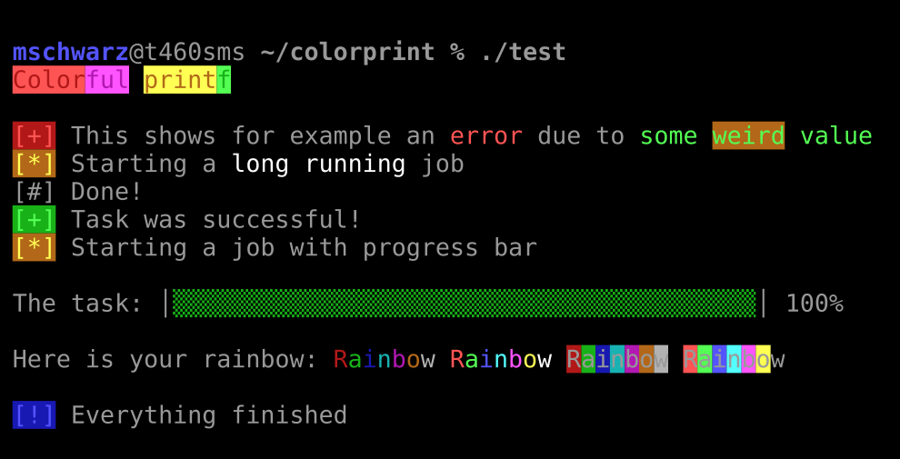

# Colorful printf

A `printf` wrapper which supports tag-like color format specifier, which can be dynamically enabled or disabled.
Furthermore, it contains an animated spinner and a progress-bar widgets for the console (also with colors).

## Requirements

The colorful printf works in any terminal supporting VT100 escape sequences, which are most terminal on Linux. It was successfully tested on XTerm, Konsole, and Gnome Terminal. 

## Usage

Colorful printf can either be used by linking it to your application (recommended) or in a header-only version which can be directly included (not recommended). The library does not require any special flags to compile.

+ **Standalone**

Simply include the `colorpint.h` in your C file and add `colorprint.c` to your project. 

See `test.c` for an example. 

+ **Header only**

First, run `make header` to generate `colorpint_header.h`. Then, simply include this header in your C file. 

See `test_header.c` for an example. 

## API

### Brief content:

> [`printf_color`](#function-printf_color): A variant of `printf` which supports tags to specify foreground and background colors. 

> [`spinner_start`](#function-spinner_start): Creates an animated spinner at the current position. 
> [`spinner_update`](#function-spinner_update): Updates the text and the animation of the current spinner. 
> [`spinner_done`](#function-spinner_done): Destroys the current spinner and sets the final text. 

> [`progress_start`](#function-progress_start): Creates a progress bar. 
> [`progress_update`](#function-progress_update): Updates the state of the progress bar. 

### Functions:

####  Function `printf_color`

It provides the same functionality as `printf` but additionally supports the specification of foreground and background colors on a letter granularity. 

**Parameters:**

- `color`: 1 if the output should be colorized, 0 to simply ignore the color tags.
- `fmt`: The `printf` format string.
- `...`: The corresponding values for the format string.

**Returns:**

Nothing

#### Function `spinner_start`

 This function creates an animated spinner at the current position. The spinner animation can be chosen from 5 different animations. 
 
 **Parameters:**
 
- `color`: 1 if the output should be colorized, 0 to simply ignore the color tags.
- `type`: The type of animation. Allowed values are 0, 1, 2, 3, and 4. 
- `fmt`: The `printf` format string.
- `...`: The corresponding values for the format string.
 

**Returns:**

Nothing

#### Function `spinner_update`

 This function updates both the text and the animation of a previously created spinner. 
 
 **Parameters:**
 
- `color`: 1 if the output should be colorized, 0 to simply ignore the color tags.
- `fmt`: The `printf` format string.
- `...`: The corresponding values for the format string.

**Returns:**

Nothing

 
#### Function `spinner_done`

 This function updates both the text and the animation of a previously created spinner to a final state. 
 
 **Parameters:**
 
- `color`: 1 if the output should be colorized, 0 to simply ignore the color tags.
- `fmt`: The `printf` format string.
- `...`: The corresponding values for the format string.
 
 
**Returns:**

Nothing

#### Function `progress_start`

 This function creates an animated progress bar at the current position.
  
 **Parameters:**
 
- `color`: 1 if the output should be colorized, 0 to simply ignore the color tags.
- `max`: The number of updates required to be at 100%. 
- `fmt`: The `printf` format string.
- `...`: The corresponding values for the format string.
 

**Returns:**

Nothing

#### Function `progress_update`

 This function updates the state of a previously created progress bar. 
 
 **Parameters:**
 
- `color`: 1 if the output should be colorized, 0 to simply ignore the color tags.

**Returns:**

Nothing
